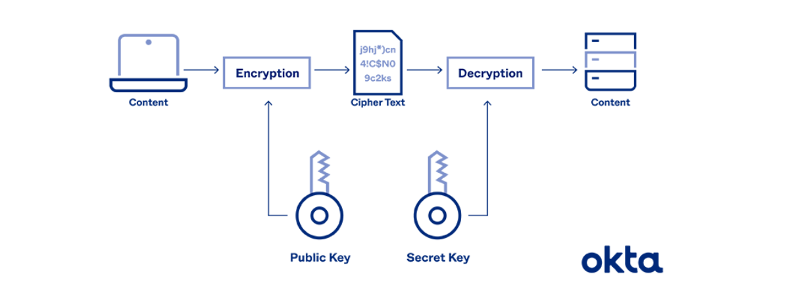
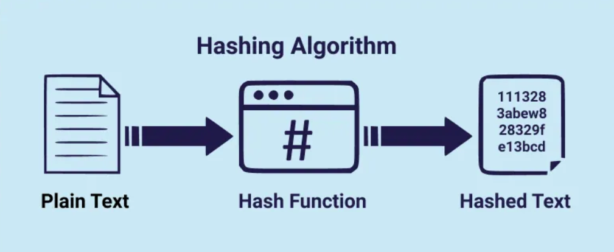
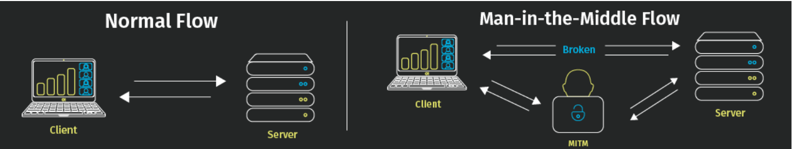

# Computer Networks

## Attack
 A deliberate attempt to compromise integrity, or availability of a computer system or network by exploiting weaknesses in design, implementation, or configuration.

Attacks can be classified as passive or active.

### Passive Attack
They attempt to learn or make use of information from the system but does not affect system resources. It includes:

- Eavesdropping message content or sniffing
- Traffic analysis

Such attacks are difficult to detect therefore the strategy is to prevent the attack.

### Active Attack
They attempt to alter system resources, or affect their operation. They include:

- Spoofing, ie. masquerading or impersonation
- Replay
- Modification, ie. altering the message, man in the middle
- DOS ,etc.

They are easier to detect but more difficult to prevent.

## Terms
**Vulnerability** is a weakness in a security system.

**Threat** is a set of circumstances that has potential to cause loss or harm.

**Controls** are ways to block a threat that tries to exploit one or more vulnerabilities.

## Security Objectives

1. **Confidentiality** - aims to protect data against unauthorized disclosure.
2. **Integrity** - aims to detect unauthorized data modification and replay.
3. **Availability** - ensures that systems work promptly and service is not denied to authorized users.

## Impacts of Security Attacks

An attack on a business can lead to:

- Economic/Financial losses
- Reputation damage
- Legal consequences

## Security Controls

**Technical Controls** 
 - Cryptography
 - Authentication and Access Control
 - Firewalls

# Cryptography 

This is the process of concealing the contents of a message from all except those who know the key.
The Key is a data string which when combined with the plain text message using an algorithm, produces output result called cipher text that is unreadable until decrypted.

A message in its original form is called ***plaintext***/ ***ClearText*** and the encrypted message is called **ciphertext**, this is a message produced in disguise form.

The process of converting plaintext to ciphertext is called **encryption** and the reverse process is called **decryption**.

There are three types of algorithms used in cryptography:

- **Symmetric Key Algorithms** - Also called 
***Secret Key, Single key encryption*** Uses a single key for both encryption and decryption. The encryption algorithm and decryption algorithm run in reverse order. 
They use a single key for both encryption and decryption.

Although this algorithm is fast, it suffers from the problem of key distribution.

Examples include 
DES(Data Encryption Standard) - 56-bit key, 
 3DES(Triple DES) - 168-bit key,
 Extended DES - 128-bit key,
 AES(Advanced Encryption Standard) uses variable key lengths of 128, 192, or 256 bits.
 CAST-128, Rivest Cipher, RC4, Blowfish, Twofish, KASUMI, Skipjack, Misty1, etc.

## Assignment Operation of DES

TODO: Add the assignment operation of DES

- **Asymmetric Key Algorithms** - ***Public Key*** Uses two keys, a public key and a private key. The public key is used for encryption and the private key is used for decryption. Examples include RSA, DSA, etc.

- **Hash Functions** - These are used to ensure data integrity. They take an input and produce a fixed-size string of bytes. Examples include MD5, SHA-1, etc.

## Asymmetric Key Algorithms
**Public key** is used for encryption and is distributed to anyone who wants to send a message to the owner of the private key.
**Private key** is used for decryption and is kept secret by the owner.

Every user has 2 keys, a public key and a private key. The public key is distributed to anyone who wants to send a message to the owner of the private key.

The two keys are mathematically related but knowledge of one key does not determine the other.

To encrypt a message and make it confidential, the sender encrypts the message using the recipient's public key. The receiver on receiving the message decrypts it using his private key.

To encrypt a message with a goal of providing source authenticity, the sender encrypts the message with his private key. The receiver confirms the source of the message by decrypting it with the sender's public key. This provides non-repudiation.

## Limitations of Asymmetric Key Algorithms
- They are slower than symmetric key algorithms
- Only used for small message encryption

## Advantages of Asymmetric Key Algorithms
- They solve the problem of key distribution
- They are more secure than symmetric key algorithms
- They provide confidentiality, authentication, and non-repudiation

Example of Asymmetric Key Algorithms include
- RSA (Rivest-Shamir-Adleman)- uses variable size block and variable key length
- Diffie Helman - used to do key exchange
- DSA (Digital Signature Algorithm) - provides digital signature for authentication of messages
- ElGamal - used for encryption and digital signature
- ECC (Elliptic Curve Cryptography)

## Hash Functions
Also called message Digests or one way encryption. 

They take a varied length of input and produce a fixed-size/length string of bytes called message digest or fingerprint.

### Characteristics of Hash Functions
- Takes an input of any length and produces a fixed-size output
- Its infeasible to generate one hash value from two different inputs
- Given one message its infeasible to find another message with the same hash value
- Given the output of a hash function, it is infeasible to find the input that produced the output

### Examples of Hash Functions
- MD5 (Message Digest 5) - produces a 128-bit hash value
- SHA-1 (Secure Hash Algorithm) - produces a 160-bit hash value
- Haval - produces a 128, 160, 192, 224, or 256-bit hash value
- Tiger - produces a 192-bit hash value
- Whirlpool - produces a 512-bit hash value
- RIPEMD - produces a 128, 160, 256, or 320-bit hash value

## Applications the three types of algorithms
- TODO

# Network Security

## Sniffing
Allows an attacker to observe data on a network.

## Spoofing
Supports an attacker to masquerade or pretend to be another machine.(Impersonation)

## Session Hijacking
An attacker steals an existing session established between a source and a destination using both sniffing and spoofing.

## Attacks
 
### Password pilfering
Method of stealing passwords from a system.
- Guessing
- Social Engineering - tricking people into revealing their passwords using social skills
- Phishing 
- Dictionary Attack
    - Obtaining info of usernames and encrypted passwords
    - Run encryption routine on each word in the dictionary names and dates
    - Compare each output with the encrypted password from step 1
    - If a match is found, the password is found

### Password sniffing
Password sniffers are programs that capture passwords from the network.

## Password Protection
- Use long passwords
- Use a combination of letters, numbers, and special characters
- Change passwords regularly
- Avoid remote login software that don't encrypt passwords
- Avoid entering information in any pop-up window and avoid clicking on links in suspicious emails
- Avoid transmitting sensitive information over the internet

## Identity Spoofing Attacks

- They allow attackers to impersonate a user without the user's  password.

ie - Man in the middle attack, Message Replay, etc.

### Man in the middle attack

Defense measures include, encrypting and authenticating IP packets, 

### Message Replay
The attacker captures/intercepts a message, keeps it intact and retransmits it later 

Defense measures include, Attach a random number to a message ie 'nonce' 

Attach a timestamp to each message

### Network Spoofing Attacks
These type of attacks involves interfering with the IP address of the communicating agents. Through changing or disguising the source IP of a system,
It helps the attacker avoid their actions being traced back to them and undermine applications that rely on IP addresses for authentication or filtering.
NMAP, DSniff,Scapy, etc.

**Examples of IP spoofing attacks**

SYN flooding - Attacker fills the target computer SYN buffer with a large number of crafted SYN packets, making the target unable to establish connections with other computers.

**4 steps**
- Attacker sends a large number of crafted SYN packets to the target computer
- The target computer is obliged to send an ACK/ acknowledgment to the crafted source IP in each SYN packet
- Because the source IP is crafted and unreachable the target computer waits for a response that never comes and therefore the crafted SYN packet remains in the TCP buffer
- Eventually, the buffer is completely occupied by the crafted SYN packets and the target computer is unable to establish connections with other computers.

**Session Hijacking**
Employs both sniffing and spoofing techniques, explained in the following steps:

- Alice sends a SYN packet to Bob
- The attacker intercepts the packet and uses SYN flooding to mute Bob so that Bob can't complete the three way handshake
- The attacker predicts the correct TCP sequence number expected from Bob to Alice and crafts an ACK packet to Alice with the correct sequence number and Bob's IP address and sends it to Alice
- Alice receives and verifies the ACK packet and sends an ACK packet to the attacker hence completing the three way handshake and establishing a TCP connection with the attacker instead of Bob

### CHAP (Challenge-Handshake Authentication Protocol)
Uses a password to modify a shared sequence between a client and a server but never allows the password in any form to go across a network

When a user logs on to a server, the user is identified by their username that was sent across the network in plain text. The server generates a random number and sends it to the client. The client encrypts the random number(Challenge) using DES which comprises the response, the password is used as the DES key and the response is sent to the server and the server does the same calculation to ensure that the values match.

### Certificate Based Authentication

A digital certificate is a document that includes the 
- Name of the subject
- The subject public key
- Serial number
- Issue and Expiry date
- Digital signature of the issuing authority

i. When a user logs on and presents the certificate, the server verifies that the certificate is valid

ii. The server sends a challenge to the user, which is a one time value 

iii. The user signs with their private key and sends back to the user as a server response. 

iv. The server then decrypts the response using the user's public key, if there is a match, then the user is authenticated.